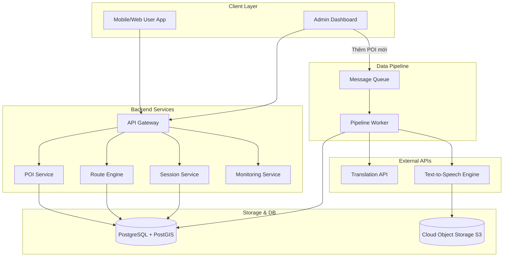

```mermaid
graph TD
    %% Tầng Client
    subgraph Client_Layer [Client Layer]
        App[Mobile/Web User App]
        Admin[Admin Dashboard]
    end

    %% Tầng Backend
    subgraph Backend_Layer [Backend Services]
        Gateway[API Gateway]
        POIService[POI Service]
        RouteService[Route Engine]
        SessionService[Session Service]
        MonitorService[Monitoring Service]
    end

    %% Tầng Pipeline & Async
    subgraph Pipeline_Layer [Data Pipeline]
        MQ[Message Queue]
        Worker[Pipeline Worker]
    end

    %% Tầng Dữ liệu
    subgraph Storage_Layer [Storage & DB]
        DB[(PostgreSQL + PostGIS)]
        S3[(Cloud Object Storage S3)]
    end

    %% Tầng API Bên Ngoài
    subgraph External_APIs [External APIs]
        TransAPI[Translation API]
        TTS[Text-to-Speech Engine]
    end

    %% Kết nối
    App --> Gateway
    Admin --> Gateway

    Gateway --> POIService
    Gateway --> RouteService
    Gateway --> SessionService
    Gateway --> MonitorService

    POIService --> DB
    RouteService --> DB
    SessionService --> DB

    Admin -->|Thêm POI mới| MQ
    MQ --> Worker
    Worker --> TransAPI
    Worker --> TTS
    TTS --> S3
    Worker --> DB
```