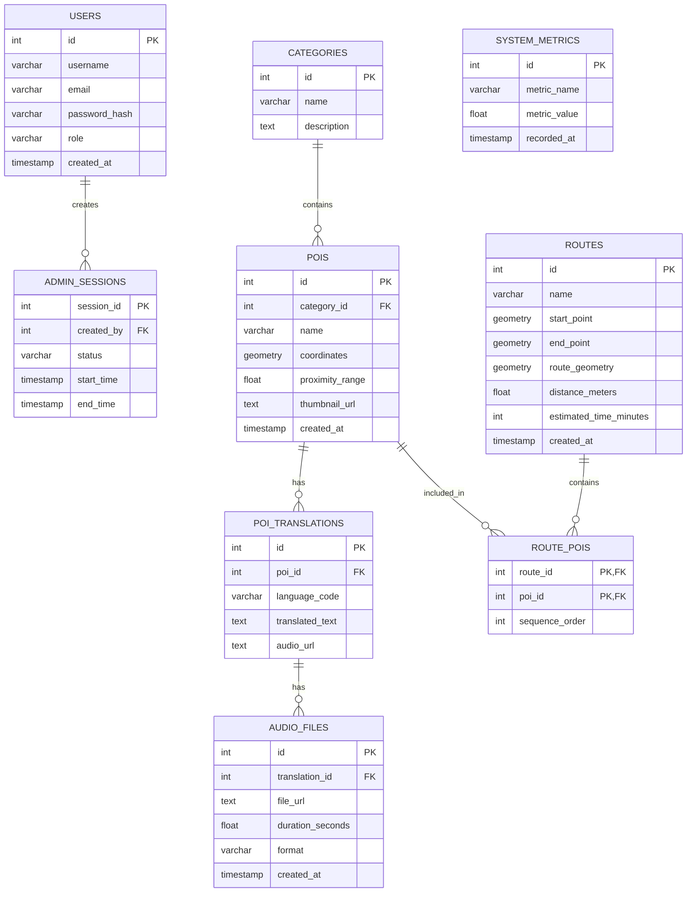

# Database ERD - Hệ thống định vị du lịch

## 1. Conceptual Level

Hệ thống gồm các entity chính:

- User
- Category
- POI
- Translation
- AudioFile
- Route
- Session
- SystemMetrics

### Các quan hệ chính

- Category có nhiều POI.
- Một POI có nhiều bản dịch.
- Một bản dịch có thể có nhiều file audio.
- Một Route có nhiều POI và một POI có thể thuộc nhiều Route.
- Một User có thể tạo nhiều Admin Session.

---

## 2. Logical Level

### Các bảng chính

| Bảng | Mục đích |
|---|---|
| users | Lưu thông tin người dùng |
| categories | Lưu danh mục địa điểm |
| pois | Lưu thông tin địa điểm |
| poi_translations | Lưu nội dung POI theo từng ngôn ngữ |
| audio_files | Lưu thông tin file âm thanh |
| routes | Lưu thông tin tuyến đường |
| route_pois | Bảng trung gian giữa Route và POI |
| admin_sessions | Lưu phiên làm việc của Admin |
| system_metrics | Lưu các chỉ số hoạt động của hệ thống |

### Quan hệ

- `categories` 1-N `pois`
- `pois` 1-N `poi_translations`
- `poi_translations` 1-N `audio_files`
- `routes` N-N `pois`
- `users` 1-N `admin_sessions`

Quan hệ N-N giữa `routes` và `pois` được triển khai thông qua bảng trung gian `route_pois`.

---

## 3. ER Diagram

---

## 4. Physical Level

Database sử dụng PostgreSQL kết hợp PostGIS để hỗ trợ dữ liệu không gian.

Các trường tọa độ được lưu bằng kiểu:

`GEOMETRY(Point, 4326)`

Các bảng chính được triển khai trong file:

`schema.sql`

### Spatial Index

Hệ thống sử dụng GiST Index cho dữ liệu không gian nhằm hỗ trợ truy vấn POI theo vị trí.

---
