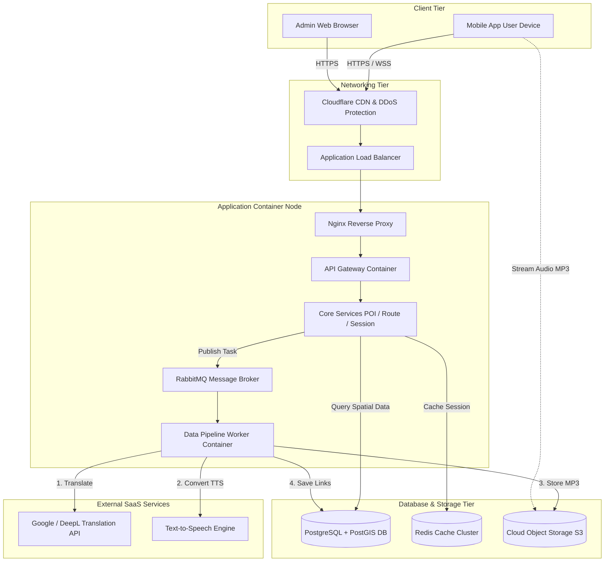

```mermaid
graph TD
    %% CLIENT TIER
    subgraph Client_Tier [Client Tier]
        MobileApp[Mobile App User Device]
        AdminBrowser[Admin Web Browser]
    end

    %% NETWORKING TIER
    subgraph Network_Tier [Networking Tier]
        Cloudflare[Cloudflare CDN & DDoS Protection]
        ALB[Application Load Balancer]
    end

    %% APPLICATION CLUSTER
    subgraph App_Cluster [Application Container Node]
        Nginx[Nginx Reverse Proxy]
        APIGateway[API Gateway Container]
        CoreServices[Core Services POI / Route / Session]
        PipelineWorker[Data Pipeline Worker Container]
        RabbitMQ[RabbitMQ Message Broker]
    end

    %% DATABASE & STORAGE TIER
    subgraph Storage_Tier [Database & Storage Tier]
        PostgreSQL[(PostgreSQL + PostGIS DB)]
        RedisCache[(Redis Cache Cluster)]
        S3Storage[(Cloud Object Storage S3)]
    end

    %% EXTERNAL APIS
    subgraph External_APIs [External SaaS Services]
        TransAPI[Google / DeepL Translation API]
        TTSEngine[Text-to-Speech Engine]
    end

    %% CONNECTIONS
    MobileApp -->|HTTPS / WSS| Cloudflare
    AdminBrowser -->|HTTPS| Cloudflare

    Cloudflare --> ALB
    ALB --> Nginx
    Nginx --> APIGateway

    APIGateway --> CoreServices
    CoreServices -->|Query Spatial Data| PostgreSQL
    CoreServices -->|Cache Session| RedisCache
    CoreServices -->|Publish Task| RabbitMQ

    RabbitMQ --> PipelineWorker
    PipelineWorker -->|1. Translate| TransAPI
    PipelineWorker -->|2. Convert TTS| TTSEngine
    PipelineWorker -->|3. Store MP3| S3Storage
    PipelineWorker -->|4. Save Links| PostgreSQL

    MobileApp -.->|Stream Audio MP3| S3Storage
```