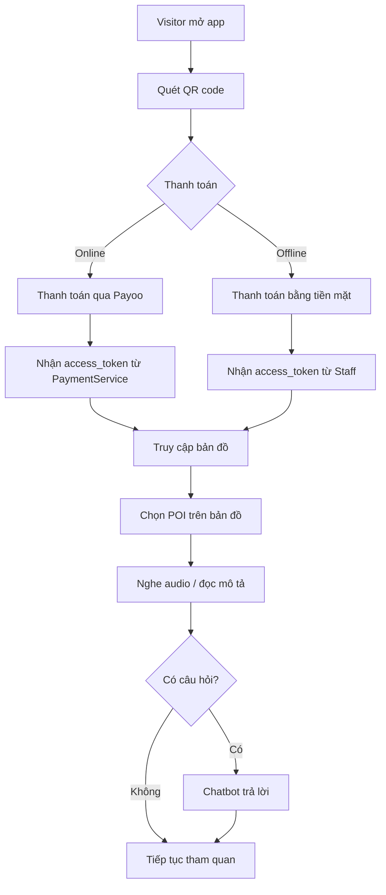

```mermaid
flowchart TD
    A[Visitor mở app] --> B[Quét QR code]
    B --> C{Thanh toán}
    C -->|Online| D[Thanh toán qua Payoo]
    C -->|Offline| E[Thanh toán bằng tiền mặt]
    D --> F[Nhận access_token từ PaymentService]
    E --> G[Nhận access_token từ Staff]
    F --> H[Truy cập bản đồ]
    G --> H[Truy cập bản đồ]
    H --> I[Chọn POI trên bản đồ]
    I --> J[Nghe audio / đọc mô tả]
    J --> K{Có câu hỏi?}
    K -->|Có| L[Chatbot trả lời]
    K -->|Không| M[Tiếp tục tham quan]
    L --> M
```

